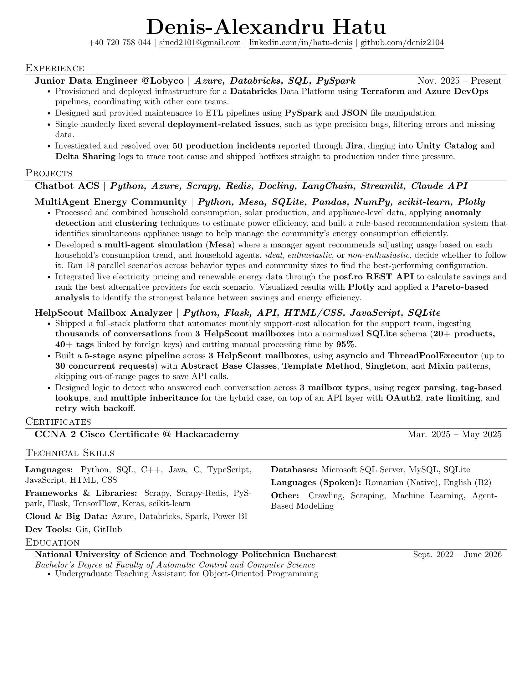

## Student at National University of Science and Technology Politehnica Bucharest

**Master's Degree at Faculty of Automatic Control and Computer Science (2026-2028)**

**Bachelor's Degree at Faculty of Automatic Control and Computer Science (2022-2026)**

## Working Experience

**Junior Data Engineer @Lobyco (Nov. 2025 - Present)**

**Junior Support Engineer @Themeisle (Jul. 2025 - Sept. 2025)**

## Skills

## Connect

